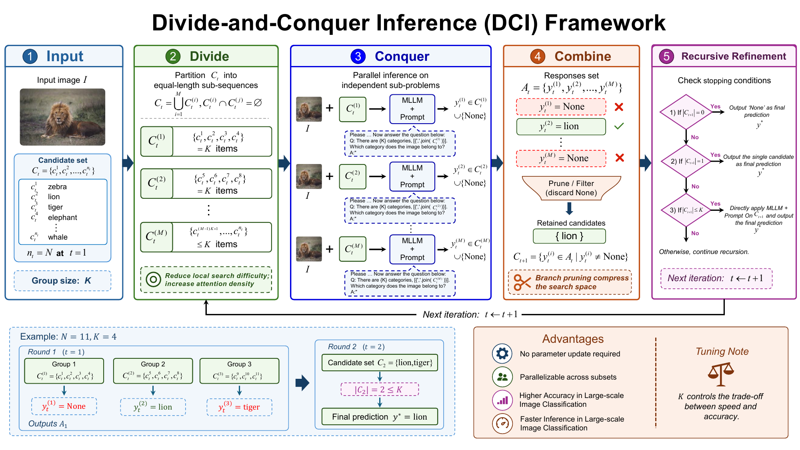
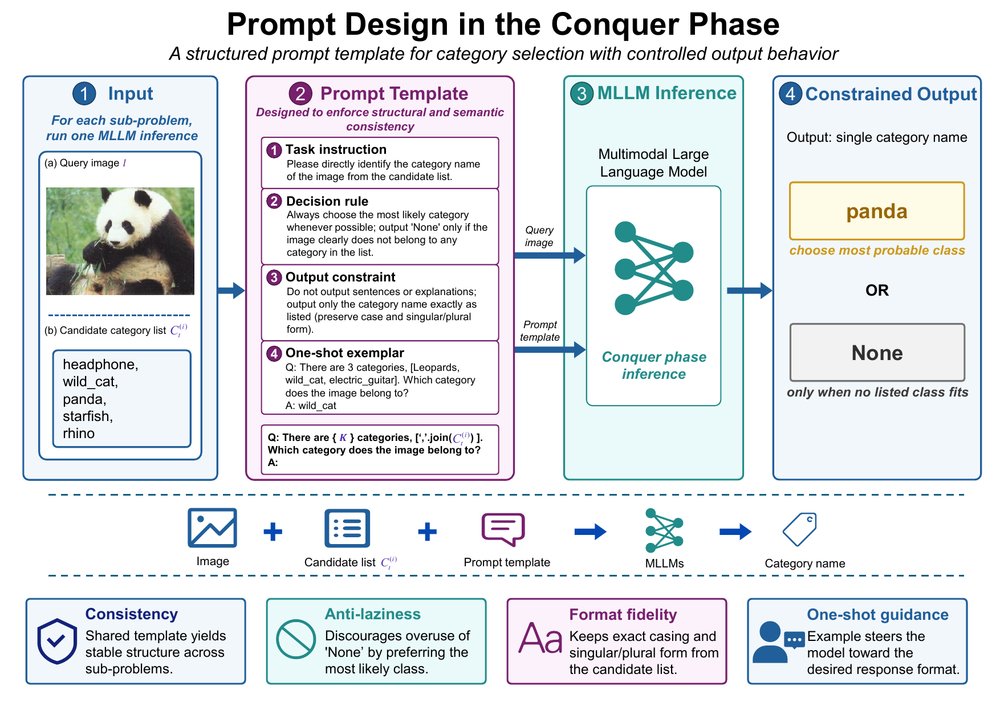
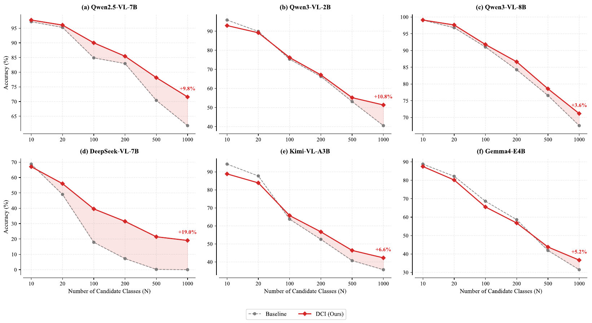
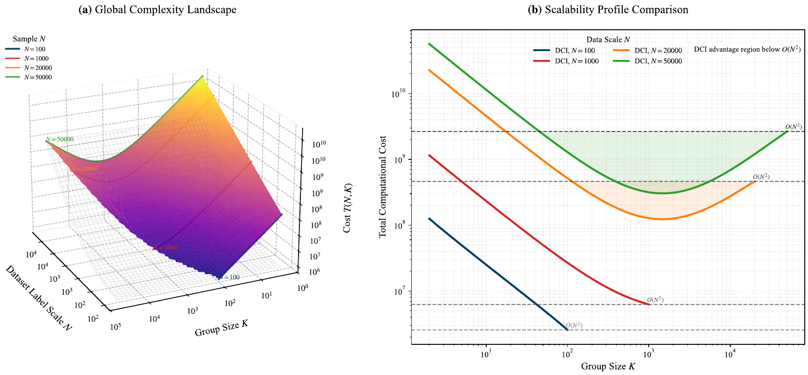

<div align="center">

# Divide-and-Conquer Inference

### A Training-Free Test-Time Scaling Strategy for Large-Scale Visual Recognition with MLLMs

[](#paper)
[](#why-dci)
[](#why-dci)
[](#why-dci)

[](https://www.python.org/)
[](LICENSE)

**Zhipeng Ye · Jiaqi Huang · Feng Jiang · Qiufeng Wang · Yikang Duan · Dawei Wang · Xihang Zhou · Qian Qiao**

<p>
  <a href="#overview">Overview</a> ·
  <a href="#method">Method</a> ·
  <a href="#quick-start">Quick Start</a> ·
  <a href="#results">Results</a> ·
  <a href="#reproducibility">Reproducibility</a> ·
  <a href="#paper">Paper</a> ·
  <a href="#citation">Citation</a>
</p>

</div>

---

## Overview

Multimodal Large Language Models perform remarkably well on many vision-language tasks, yet their recognition accuracy can collapse when the candidate label space becomes large. We identify this phenomenon as **Performance Collapse in Long Sequence Recognition (PC-LSR)**.

The underlying issue is a scaling conflict:

- **Uncertainty grows** as the number of candidate classes increases.
- **Attention is diluted** across increasingly long candidate sequences.
- **Signal-to-noise ratio decreases**, making the correct label harder to recover.

We introduce **Divide-and-Conquer Inference (DCI)**, a test-time scaling strategy that replaces one difficult global decision with a sequence of smaller, localized decisions. DCI recursively partitions the candidate space, solves sub-problems in parallel, and dynamically prunes unlikely branches.

> DCI turns large-scale classification from a flat search over thousands of labels into a coarse-to-fine reasoning process.

## Method

<p align="center">
  
</p>

Given an image and a candidate set of $N$ categories, DCI proceeds through five stages:

1. **Divide** the candidate set into compact groups of size $K$.
2. **Conquer** each independent sub-problem with the same MLLM.
3. **Combine** the local predictions.
4. **Prune** invalid or rejected branches.
5. **Refine recursively** until a single prediction remains.

The group size $K$ provides a practical accuracy-efficiency trade-off. Smaller groups reduce local ambiguity and attention dilution, while independent groups can be evaluated in parallel.

### Conquer-phase prompting

<p align="center">
  
</p>

A shared structured prompt enforces consistent decisions across sub-problems. It encourages the model to choose the most probable category, preserves the exact label format, and restricts the response to a single category name or `None`.

## Why DCI?

| Property | Description |
|:--|:--|
| **Training-free** | No additional training, fine-tuning, or parameter update is required. |
| **Model-agnostic** | The same inference strategy can be applied to different MLLM families. |
| **Plug-and-play** | DCI operates at inference time without modifying model architecture. |
| **Scalable** | Dynamic pruning compresses the search space as inference progresses. |
| **Parallelizable** | Independent candidate groups can be processed concurrently. |
| **Efficient** | DCI avoids the prohibitive scaling behavior of flat long-sequence inference. |

## Quick Start

This repository provides a unified, dataset-agnostic implementation of DCI for any multimodal model served through an **OpenAI-compatible API**. The runner supports recursive candidate pruning, parallel conquer calls, resumable evaluation, deterministic sampling, flat-prompt baselines, and per-run accuracy reports.

### Installation

```bash
git clone https://github.com/FourierAI/DCI.git
cd DCI

python -m venv .venv
source .venv/bin/activate
pip install -e .
```

Python 3.9 or later is required. For development and testing, use
`pip install -e ".[dev]"`.

### Serve an MLLM

Start a vision-language model with an OpenAI-compatible server. For example, with vLLM:

```bash
pip install vllm
vllm serve Qwen/Qwen3-VL-2B-Instruct --port 8000
```

You may also use another local or remote provider by passing `--api-base` and, when required, `--api-key`.

### Prepare datasets

The repository includes the metadata and evaluation splits used by the runner, but not the copyrighted dataset images. Place images under the default locations below, or point to an existing installation with `--image-root`.

| Dataset | CLI name | Default image root |
|:--|:--|:--|
| CIFAR-100 | `cifar100` | `data/images/cifar100/` |
| CUB-200-2011 | `cub200` | `data/images/cub200/` |
| Caltech-256 | `caltech256` | `data/images/caltech256/` |
| Food-101 | `food101` | `data/images/food101/` |
| ImageNet-1K | `imagenet1k` | `data/images/imagenet1k/` |
| ImageNet-21K label space | `imagenet21k` | `data/images/imagenet1k/` |

ImageNet-21K experiments evaluate ImageNet-1K images against the expanded 21K candidate vocabulary, matching the large-label-space setting studied in the paper.

### Run DCI

```bash
dci-eval \
  --dataset imagenet1k \
  --model Qwen/Qwen3-VL-2B-Instruct \
  --image-root /path/to/imagenet/val \
  --k-values 100 50 20 10 \
  --max-workers 10
```

For a quick smoke test:

```bash
dci-eval \
  --dataset cifar100 \
  --model Qwen/Qwen3-VL-2B-Instruct \
  --image-root /path/to/cifar100_test_images \
  --k-values 10 \
  --max-samples 20
```

Run the conventional flat-prompt baseline:

```bash
dci-eval \
  --dataset imagenet1k \
  --model Qwen/Qwen3-VL-2B-Instruct \
  --image-root /path/to/imagenet/val \
  --baseline
```

Results are written to:

```text
outputs/<dataset>/<model>/k-<K>.jsonl
outputs/<dataset>/<model>/k-<K>.txt
outputs/<dataset>/<model>/k-<K>.manifest.json
```

Existing JSONL records are detected automatically, so interrupted evaluations can be resumed with the same command.
Each manifest records the command arguments, model, K value, platform, Python
version, timestamp, and Git revision. API keys are never written to disk.

### Key options

| Option | Description |
|:--|:--|
| `--dataset` | One of the six bundled dataset configurations. |
| `--model` | Model identifier exposed by the inference server. |
| `--api-base` | OpenAI-compatible endpoint; defaults to `http://127.0.0.1:8000/v1`. |
| `--image-root` | Local root containing dataset images. |
| `--k-values` | Candidate group sizes to evaluate. |
| `--max-workers` | Maximum parallel conquer calls. |
| `--max-retries` | Retries for transient API failures; defaults to 5. |
| `--max-samples` | Optional cap for fast experiments. |
| `--samples-per-class` | Optional class-balanced sampling. |
| `--baseline` | Disable decomposition and use one flat candidate prompt. |

### Repository layout

```text
DCI/
├── dci/
│   ├── configs.py          # Dataset registry and default K values
│   └── runner.py           # Unified DCI evaluation CLI
├── data/
│   ├── README.md           # Dataset sources and setup
│   └── metadata/           # Evaluation splits and class vocabularies
├── tests/                  # Unit tests for core inference utilities
├── assets/figures/         # Paper figures used in this README
├── CITATION.cff
├── LICENSE
├── pyproject.toml
└── README.md
```

## Results

We evaluate DCI on **ImageNet-1K**, **ImageNet-21K**, **CIFAR-100**, **CUB-200**, and **Food-101** across diverse open- and closed-source MLLMs.

<p align="center">
  
</p>

Across six representative MLLMs, DCI consistently mitigates accuracy degradation as the candidate space expands. At 1,000 candidate classes, the observed improvements include:

| Model | Accuracy gain |
|:--|--:|
| Qwen2.5-VL-7B | **+9.8 pp** |
| Qwen3-VL-2B | **+10.8 pp** |
| Qwen3-VL-8B | **+3.6 pp** |
| DeepSeek-VL-7B | **+19.0 pp** |
| Kimi-VL-A3B | **+6.6 pp** |
| Gemma4-E4B | **+5.2 pp** |

These results show that test-time decomposition can allow lightweight open-source models to remain competitive in large-scale recognition without additional training.

### Complexity and scalability

<p align="center">
  
</p>

Flat inference processes the entire candidate space in one long context and inherits the quadratic cost of self-attention. DCI instead controls local sequence length through grouping and progressively reduces the active search space through pruning, yielding substantially more favorable scaling behavior in large-label regimes.

## Reproducibility

The repository is designed to make every run auditable:

- Dataset splits and candidate vocabularies are versioned under `data/metadata/`.
- Sampling is deterministic for a fixed `--seed`.
- Interrupted JSONL evaluations resume without recomputing completed images.
- Every run writes a manifest with its environment and Git revision.
- Unit tests validate grouping, normalization, sampling, image encoding, and
  resume logic.

For a controlled comparison, run the baseline and DCI with the same dataset,
model endpoint, image root, seed, and sample selection:

```bash
dci-eval --dataset imagenet1k --model MODEL --image-root IMAGE_ROOT --baseline
dci-eval --dataset imagenet1k --model MODEL --image-root IMAGE_ROOT --k-values 100
```

Model serving implementations may differ in image preprocessing, chat templates,
and decoding defaults. Record the exact serving framework, model revision, GPU,
and framework version when reporting results. Dataset download sources and
licensing notes are documented in [`data/README.md`](data/README.md).

## Abstract

Multimodal Large Language Models (MLLMs) have demonstrated strong capabilities across a wide range of vision-language tasks. However, when applied to large-scale image classification, their performance degrades significantly as the label space expands—a phenomenon we define as Performance Collapse in Long Sequence Recognition. Through an information-theoretic analysis, we reveal that this collapse stems from a fundamental conflict between escalating information entropy and attention dilution and decay, which impairs the model's ability to maintain a sufficient signal-to-noise ratio when processing extremely long prompts.

To mitigate this issue, we propose Divide-and-Conquer Inference (DCI), a novel test-time scaling strategy for visual recognition with MLLMs. DCI recursively decomposes complex global classification tasks into simpler localized sub-problems and employs dynamic pruning to compress the search space. The method improves the local signal-to-noise ratio, mitigates weight dilution in long-sequence inference, and achieves favorable computational scaling. Extensive experiments demonstrate consistent accuracy improvements across large-scale recognition benchmarks without additional training or fine-tuning.

## Paper

**Divide-and-Conquer Inference for Large-Scale Visual Recognition with Multimodal Large Language Models**

The manuscript is currently under review. The accompanying experimental code and evaluation metadata are available in this repository.

## Citation

If you find DCI useful in your research, please consider citing our work:

```bibtex
@misc{ye2026dci,
  title  = {Divide-and-Conquer Inference for Large-Scale Visual Recognition with Multimodal Large Language Models},
  author = {Zhipeng Ye and Jiaqi Huang and Feng Jiang and Qiufeng Wang and Yikang Duan and Dawei Wang and Xihang Zhou and Qian Qiao},
  year   = {2026},
  note   = {Manuscript under review; source code available at \url{https://github.com/FourierAI/DCI}}
}
```

GitHub also provides citation metadata directly from
[`CITATION.cff`](CITATION.cff).

## License

The code is released under the [MIT License](LICENSE). Dataset images are
governed by their respective licenses and are not redistributed.

## Acknowledgements

We thank the open-source multimodal research community for making large-scale evaluation and reproducible research possible.

---

<div align="center">
  <b>DCI: divide the search space, preserve the signal, and scale visual recognition.</b>
</div>
