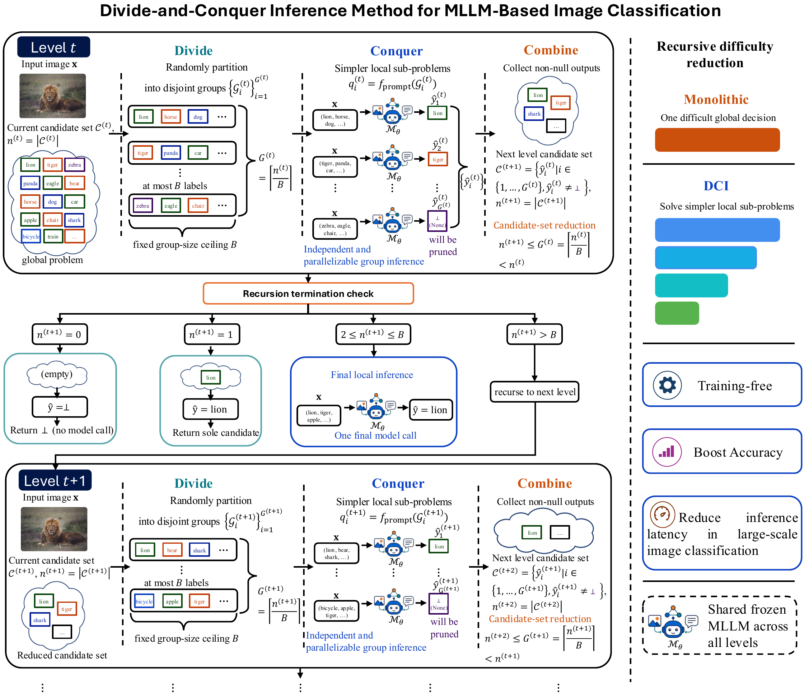
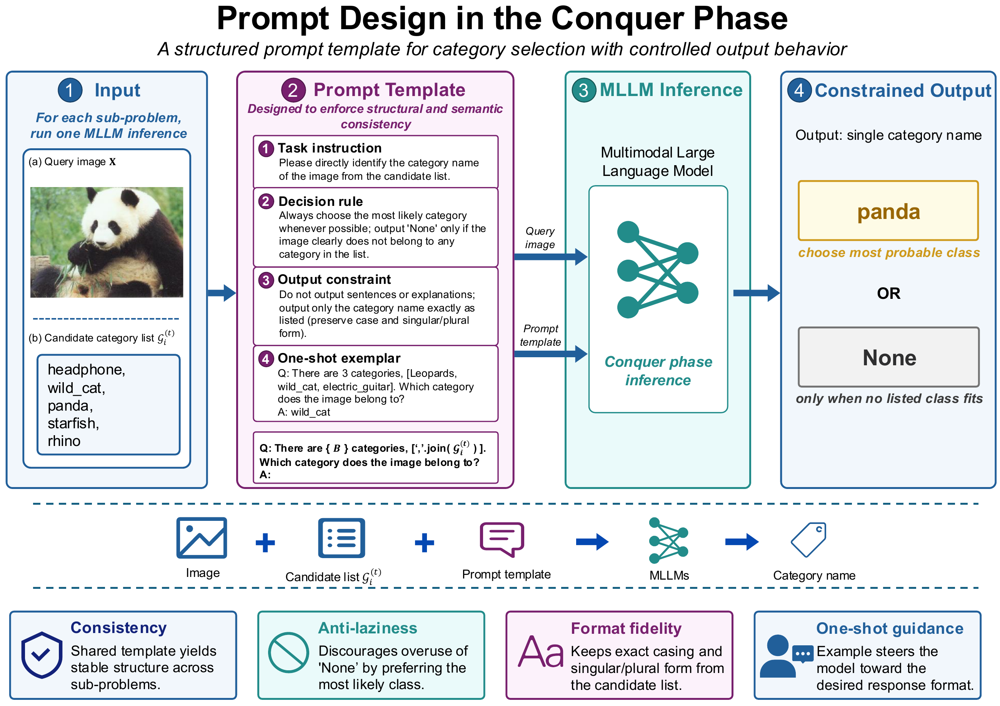
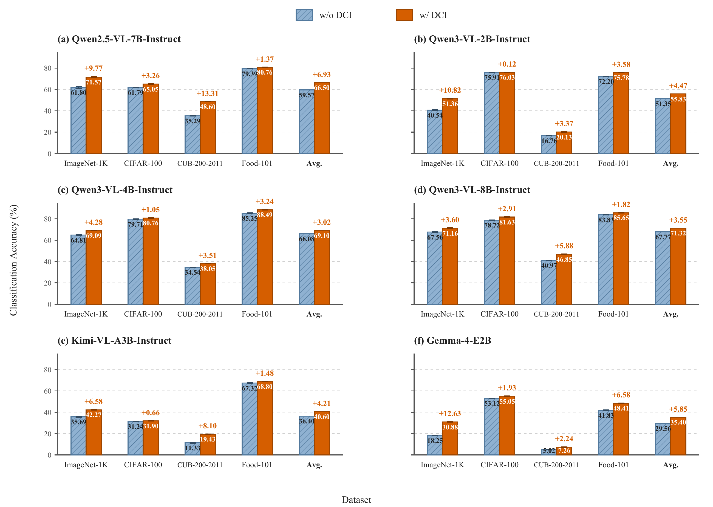
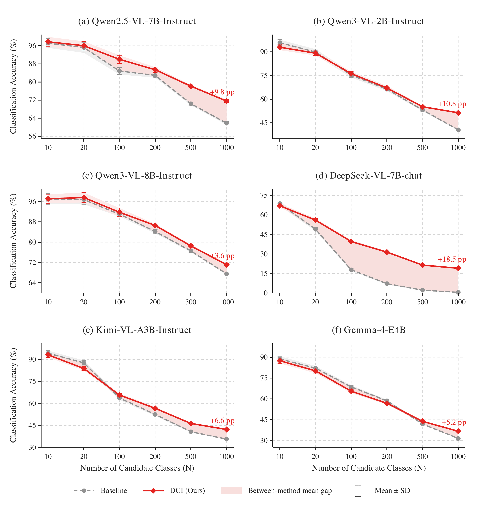
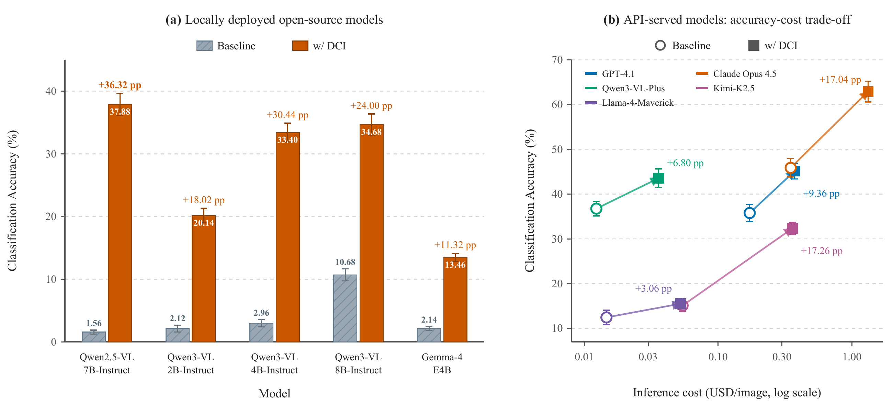
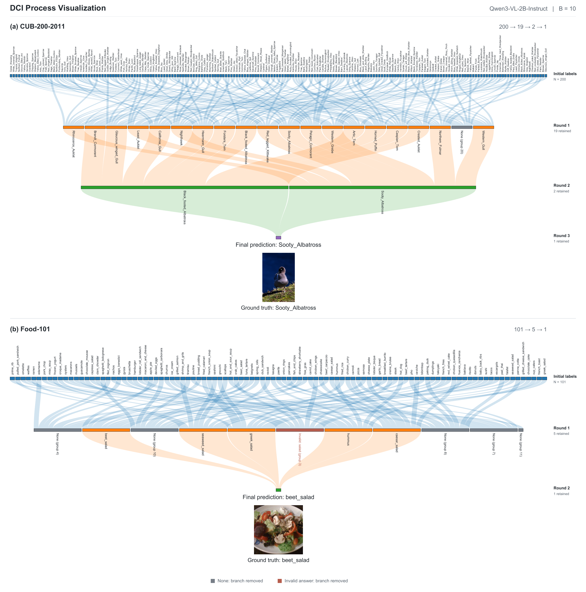
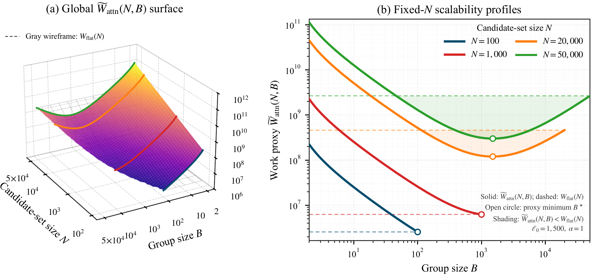

<div align="center">

# Divide-and-Conquer Inference

### Large-Scale Image Classification with Multimodal Large Language Models

[](#paper)
[](https://fourierai.github.io/DCI/)
[](#method)
[](https://www.python.org/)
[](LICENSE)

**Zhipeng Ye<sup>1</sup> · Jiaqi Huang<sup>1,2</sup> · Feng Jiang<sup>1,*</sup> · Qiufeng Wang<sup>2</sup> · Yikang Duan<sup>2</sup> · Dawei Wang<sup>1</sup> · Kaixin Liu<sup>1</sup> · Hao Li<sup>3</sup>**

<sup>1</sup> Taizhou Institute of Science and Technology, Nanjing University of Science and Technology, China<br>
<sup>2</sup> Department of Intelligent Science, Xi’an Jiaotong-Liverpool University, China<br>
<sup>3</sup> Department of Computer Science, University of Arizona, USA<br>
<sup>*</sup> Corresponding author: Feng Jiang · jf@nustti.edu.cn<br>
Jiaqi Huang: Jiaqi.Huang26@student.xjtlu.edu.cn

[Project Page](https://fourierai.github.io/DCI/) ·
[Method](#method) ·
[Reproduction](#paper-protocol) ·
[Results](#results) ·
[Reported data](data/results/README.md) ·
[Paper alignment](docs/PAPER_ALIGNMENT.md) ·
[Citation](#citation)

</div>

---

## Overview

When a multimodal large language model (MLLM) is asked to classify an image
from a growing list of labels, its mean accuracy generally decreases. The paper
calls this empirical pattern **candidate-space performance degradation**. All
evaluated prompts remain within their models' context windows, so truncation
does not explain the reported trend. Candidate interference and limited
long-context utilization are plausible contributors to the observed difficulty.

**Divide-and-Conquer Inference (DCI)** is a training-free test-time strategy for
this setting. It replaces one monolithic decision with recursively smaller local
decisions, using the same frozen MLLM and no auxiliary classifier.

<p align="center">
  
</p>

## Method

For an image and a candidate set of size $N$, DCI uses a maximum local group
size $B$:

1. **Divide:** randomly partition the active candidates into disjoint groups of
   at most $B$ labels.
2. **Conquer:** query the same MLLM independently for every group. The shared
   prompt permits one listed label or the literal response `None`.
3. **Combine:** validate each output against its local group, retain at most one
   valid category, and discard `None` and invalid responses.
4. **Recurse:** repeat while more than $B$ candidates remain.

The terminal rules match Algorithm 1 in the manuscript:

- an empty candidate set returns `None` without another model call;
- a singleton candidate set returns that label without another model call;
- a set containing 2 through $B$ labels receives one final local query.

At every non-terminal level,
$n^{(t+1)} \leq \lceil n^{(t)}/B \rceil < n^{(t)}$, so the procedure
terminates for $B \geq 2$. Group calls at the same level are independent and
can be executed in parallel.

<p align="center">
  
</p>

The exact author-supplied templates are in [`dci/prompts.py`](dci/prompts.py).
**Flat and DCI use different output instructions:** Flat requests one category
from the complete vocabulary; DCI additionally permits `None`. DCI retains this
instruction in its final local call, including the single-call case $N=B$.

[`dci/validation.py`](dci/validation.py) removes fixed answer wrappers and matches
one **complete category name** against the supplied list, restoring its canonical
case. `None` and invalid responses both contribute no candidate. A single
out-of-group label is invalid even if its name contains a shorter in-group label:
`tiger cat` is not accepted as `cat`. Full ImageNet synset descriptions containing
commas are treated as complete labels, not split into multiple predictions.
The same validation applies to Flat, every recursive DCI level, and the final
local call. Invalid successful responses are not retried; a null final result
counts as incorrect and stays in the denominator.

## Installation

```bash
git clone https://github.com/FourierAI/DCI.git
cd DCI

python -m venv .venv
source .venv/bin/activate
pip install -e .
```

Python 3.9 or later is required. Install development dependencies with
`pip install -e ".[dev]"`.

Start an instruction-tuned vision-language model behind an OpenAI-compatible
endpoint. For example:

```bash
pip install vllm
vllm serve Qwen/Qwen3-VL-2B-Instruct --port 8000
```

Use `--api-base` and `--api-key` for another local or hosted endpoint.

## Dataset setup

Images are not redistributed. The runner validates the paper's evaluation
counts before starting inference.

| Dataset | CLI name | Paper evaluation split | Expected images | Default $B$ |
|:--|:--|:--|--:|--:|
| CIFAR-100 | `cifar100` | complete official test split | 10,000 | 10 |
| CUB-200-2011 | `cub200` | complete official test split | 5,794 | 10 |
| Food-101 | `food101` | complete official test split | 25,250 | 10 |
| ImageNet-1K | `imagenet1k` | official validation split | 50,000 | 10 |
| ImageNet-21K | `imagenet21k` | full-vocabulary stress-test pool | 1,000 sampled/run | 100 |

For CUB-200-2011, keep `images.txt`, `image_class_labels.txt`, `classes.txt`,
and `train_test_split.txt` beside the `images/` directory. For Food-101, keep
`meta/test.txt` beside `images/`. The runner reads these official files directly
instead of using unrelated train or repository-specific splits. See
[`data/README.md`](data/README.md) for exact layouts.

The ImageNet-21K experiment uses the complete 21,843-synset vocabulary and
samples 1,000 distinct images uniformly without replacement from the available
ImageNet-21K pool in each run. If the pool is arranged under WNID directories,
build a reusable index:

```bash
dci-index-imagenet21k \
  --image-root /path/to/imagenet21k \
  --output /path/to/imagenet21k-index.json
```

## Quick start

A short smoke test (one run, 20 images) is:

```bash
dci-eval \
  --dataset cifar100 \
  --model Qwen/Qwen3-VL-2B-Instruct \
  --image-root /path/to/cifar100_test_images \
  --b-values 10 \
  --runs 1 \
  --max-samples 20
```

`--k-values` remains a compatibility alias for `--b-values`, but the repository
uses $B$ throughout to match the paper.

## Paper protocol

The defaults use five independent runs, random grouping, and the paper's
dataset-specific $B$. Use the same initial seed, candidate sizes, images,
model endpoint, and decoding configuration for paired baseline/DCI commands.
The baseline flag selects the Flat template independently of $B$. Optional
`--temperature`, `--top-p`, and `--max-tokens` overrides are recorded in the run
manifest; when omitted, the serving defaults are retained. Record the endpoint's
model revision, preprocessing, context limit, batching, GPU allocation and cache
configuration alongside the output directory. The CLI's default concurrency of
10 is a configurable software default, not a recovered paper measurement setting.

### Full ImageNet-1K comparison

```bash
dci-eval \
  --dataset imagenet1k \
  --model MODEL \
  --image-root /path/to/imagenet/val \
  --b-values 10 \
  --runs 5 \
  --seed 0

dci-eval \
  --dataset imagenet1k \
  --model MODEL \
  --image-root /path/to/imagenet/val \
  --baseline \
  --runs 5 \
  --seed 0
```

### Candidate-set scaling on ImageNet-1K

For every run and every $N<1000$, the runner independently samples $N$
classes and evaluates all 50 official validation images per selected class. At
$N=1000$, it uses all classes and all 50,000 images.

```bash
dci-eval \
  --dataset imagenet1k \
  --model MODEL \
  --image-root /path/to/imagenet/val \
  --candidate-counts 10 20 100 200 500 1000 \
  --b-values 10 \
  --runs 5 \
  --seed 0
```

Run the same command with `--baseline` for paired monolithic inference.

### ImageNet-21K full-vocabulary stress test

```bash
dci-eval \
  --dataset imagenet21k \
  --model MODEL \
  --image-root /path/to/imagenet21k \
  --metadata /path/to/imagenet21k-index.json \
  --b-values 100 \
  --runs 5 \
  --seed 0
```

The 1,000-image per-run sample is automatic for `imagenet21k`. The default
`--max-retries 0` reproduces the paper's retry-until-response policy; set a
positive value to impose a finite retry limit. Invalid model outputs are never
retried.

### Group-size sweeps

The standard-label-space sweep in the paper uses
`--b-values 2 5 10 20 50`. The ImageNet-21K trade-off figure uses
`--b-values 50 100 500 1000 5000`.

## Outputs and reproducibility

```text
outputs/<dataset>/<model>/
├── n-<N>/run-01/b-<B>.jsonl
├── n-<N>/run-01/b-<B>.txt
├── n-<N>/run-01/b-<B>.manifest.json
├── n-<N>/run-01/baseline.jsonl
└── summary.json
```

- JSONL files resume without recomputing completed images. Changed prompts,
  validation rules, candidate selections or decoding settings require a fresh
  output directory to prevent mixing incompatible predictions.
- Per-image groupings are deterministic from the run seed and image path, so a
  resumed run uses the same partitions.
- Manifests record the exact candidate list, run seed, prompt hash, full catalog
  hash, environment, command arguments, and Git revision. API keys are omitted.
- Each JSONL record stores the prediction, target, call count and per-image
  end-to-end latency. `--save-traces` also records local candidates, raw responses
  and their `selected` / `none` / `invalid` validation outcomes.
- `summary.json` reports run-level correct/total counts, accuracies and mean ± SD.
  `--sd-ddof 0` (default) uses population SD; `--sd-ddof 1` uses sample SD. The
  selected convention is stored explicitly. Accuracy is calculated from counts
  without step snapping. Stored image timings support complete-run latency
  summaries after a resumed run.
- ImageNet labels that share the same display name are deterministically
  disambiguated, preserving all 1,000 class IDs and all 21,843 synsets.

## Results

The [reported-results release](data/results/README.md) contains the current
manuscript's summary workbooks and machine-readable figure data, synchronized
on **2026-09-03**. Reported means and SDs are copied unchanged. Correction history
is retained in the workbooks; original five-run prediction logs are unavailable.
New CLI runs produce separate measurements and do not overwrite this release.

Across the 24 model-dataset combinations in the main comparison, DCI has higher
observed mean accuracy in every case, with an overall macro-average gain of
4.67 percentage points.

<p align="center">
  
</p>

At $N=1000$ on the ImageNet-1K candidate-scaling experiment, the reported
absolute gains are +9.77 pp (Qwen2.5-VL-7B-Instruct), +10.82 pp
(Qwen3-VL-2B-Instruct), +3.60 pp (Qwen3-VL-8B-Instruct), +18.54 pp
(DeepSeek-VL-7B-chat), +6.58 pp (Kimi-VL-A3B-Instruct), and +5.21 pp
(Gemma-4-E4B).

At $N=B=10$, the six-model mean gain is **−1.05 pp**. Kimi-VL-A3B-Instruct
has Flat **94.28%** and DCI **93.16%** (−1.12 pp). The small-set comparison
retains the different Flat/DCI instructions; both methods make one call.

<p align="center">
  
</p>

In the full-vocabulary ImageNet-21K stress test, DCI improves all evaluated
local and API-served models. Selected configurations also reduce measured
latency relative to monolithic inference; this is a measured hardware-dependent
result rather than a universal latency guarantee.

At $B=100$, Qwen2.5-VL-7B-Instruct changes from **1.56%** to **37.88%**
(+36.32 pp). At $B=500$, Qwen3-VL-2B-Instruct obtains **19.70%** at
**5.99 s/image**, compared with Flat **2.12%** at **7.96 s/image**;
Gemma-4-E4B obtains **15.82%** at **6.88 s/image**, compared with Flat
**2.14%** at **16.39 s/image**. Full mean ± SD values are in the data release.

<p align="center">
  
</p>

The paper's complete figure set is available as source PDF plus web PNG under
[`assets/figures/`](assets/figures/). The project page mirrors the PNGs under
`docs/assets/`.

### Qualitative examples (Figure 12)

Both examples use **Qwen3-VL-2B-Instruct, $B=10$**. The candidate counts are
**200 → 19 → 2 → 1** for CUB-200-2011 and **101 → 5 → 1** for Food-101.
`None` and invalid outputs are removed before the next level.

<p align="center">
  
</p>

## Complexity and limitations

For a balanced hierarchy, the paper bounds the worst-case local-call count by
approximately $N/(B-1)+\lceil\log_B N\rceil$. Its squared-attention proxy is

$$
\widetilde W_{\mathrm{attn}}(N,B)
= \frac{N-1}{B-1}(\ell_0+\alpha B)^2.
$$

This proxy exposes a trade-off: increasing $B$ reduces the number of calls but
lengthens each local prompt. DCI can take longer than monolithic inference on
smaller label spaces, and the best $B$ depends on the model and the target
accuracy-latency or accuracy-cost budget.

<p align="center">
  
</p>

## Paper

**Divide-and-Conquer Inference for Large-Scale Image Classification with
Multimodal Large Language Models**

The manuscript is under review. The repository implementation, protocol, claims,
notation, and figures are tracked against the manuscript in
[`docs/PAPER_ALIGNMENT.md`](docs/PAPER_ALIGNMENT.md).

## Citation

```bibtex
@misc{ye2026dci,
  title  = {Divide-and-Conquer Inference for Large-Scale Image Classification with Multimodal Large Language Models},
  author = {Zhipeng Ye and Jiaqi Huang and Feng Jiang and Qiufeng Wang and Yikang Duan and Dawei Wang and Kaixin Liu and Hao Li},
  year   = {2026},
  note   = {Manuscript under review; source code available at \url{https://github.com/FourierAI/DCI}}
}
```

The code is released under the [MIT License](LICENSE). Dataset images remain
subject to their respective licenses and are not redistributed.
